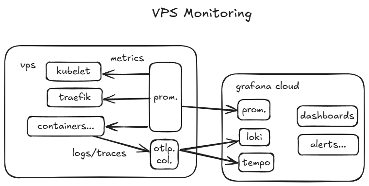

# helm.x3huang.dev

This repository manages all `helm` charts for my personal site for blogging [x3huang.dev](https://x3huang.dev) using `helmfile`.  
Deployments are automated via CI/CD pipelines that deploy to a VPS over HTTP so that **ALL** infra of the site can be reproduced anywhere, anytime, explicitly.

## Features

- **Declarative Management**: Use `helmfile` to declare, manage, and deploy multiple Helm charts.
- **Automated CI/CD**: Integration with GitHub Actions for continuous delivery.
- **Env Values and Secrets Management**: Use values differ by environment in `./values` and injected by helmfile. Secrets are injected by workflow.

## Architecture

The infrastructure consists of several key components:

### Core Components
- **TLS Certificates** (`ingress-cert/`): Automatic SSL/TLS certificate management
- **Monitoring Stack** (`prom-stack/`): Prometheus, Grafana, and exporters for system monitoring
- **Example Application** (`dummy-page/`): Reference implementation with ingress configuration
- **Ingress Controller** (`kube-system/`): Traefik-based ingress management

### Monitoring Dashboard


## Prerequisites

- `helm` >= v3.17.3
- `helmfile` >= v1.0.0

``` bash
❯ kubectl version
Client Version: v1.32.4+k3s1
Kustomize Version: v5.5.0
Server Version: v1.32.4+k3s1
```

## Comments

1. Need to install some CRDs manually if not installed at least once before.
2. Change `./values` if domain name changes.
3. Add files in `./secrets` as secrets in workflow.
4. Run `sudo mount --make-shared /` so that prom. node exporter container can start successfully.
5. Traefik config is managed by k3s since I do not install another one. So... ALL entrypoints are configured in `/var/lib/rancher/k3s/server/manifests/traefik-config.yaml` inside the main host.

```yaml
# /var/lib/rancher/k3s/server/manifests/traefik-config.yaml
---
apiVersion: helm.cattle.io/v1
kind: HelmChartConfig
metadata:
  name: traefik       # must exactly match the HelmChart name
  namespace: kube-system
spec:
  valuesContent: |-
    ########################################
    ## 1) METRICS (Prometheus) ENTRYPOINT ##
    ########################################

    # Enable Prometheus metrics in Traefik and bind its entryPoint to :8082
    metrics:
      prometheus:
        enabled: true
        # This tells Traefik which entryPoint to use for Prometheus metrics
        entryPoint: metrics

    ################################################################
    ## 2) ADDITIONAL ARGUMENTS (all entryPoints listed below)    ##
    ################################################################

    # Each "--entryPoints.<name>.address=:<port>" line ​binds Traefik’s pod to that port.
    # We also pass proxyProtocol.trustedIPs so Docker-Mailserver sees the real client IP.
    additionalArguments:
      # Metrics entryPoint is still commented out:
      # - "--entryPoints.metrics.address=:9100"

      # ─── MAIL ENTRYPOINTS (original ports) ─────────────────────────────
      # - "--entryPoints.mail-smtp.address=:25"
      - "--entryPoints.mail-smtp.proxyProtocol.trustedIPs=0.0.0.0/0"

      # - "--entryPoints.mail-submission.address=:587"
      - "--entryPoints.mail-submission.proxyProtocol.trustedIPs=0.0.0.0/0"

      # - "--entryPoints.mail-imaps.address=:993"
      - "--entryPoints.mail-imaps.proxyProtocol.trustedIPs=0.0.0.0/0"

      # - "--entryPoints.mail-pop3s.address=:995"
      - "--entryPoints.mail-pop3s.proxyProtocol.trustedIPs=0.0.0.0/0"

    ############################################################
    ## 3) EXPOSED PORTS (map each entryPoint → external port) ##
    ############################################################

    # Under "ports:" we declare which ports Traefik’s Service object should open on each Node,
    # and how they map back to the containerPort (the same value here).
    ports:
      # # ─── METRICS PORT ───────────────────────────────────────────────
      # metrics:
      #   port: 9100
      #   expose:
      #     default: true
      #   exposedPort: 9100
      #   protocol: TCP

      # ─── MAIL: SMTP (listen on :25, forward internally to proxy-port 12525) ─┐
      mail-smtp:
        port: 25
        expose:
          default: true
        exposedPort: 25
        protocol: TCP
      # ────────────────────────────────────────────────────────────────────────┘

      # ─── MAIL: Submission (listen on :587 → forward internally to proxy-port 10587) ─┐
      mail-submission:
        port: 587
        expose:
          default: true
        exposedPort: 587
        protocol: TCP
      # ────────────────────────────────────────────────────────────────────────────────┘

      # ─── MAIL: IMAPS (listen on :993 → forward internally to proxy-port 10993) ─┐
      mail-imaps:
        port: 993
        expose:
          default: true
        exposedPort: 993
        protocol: TCP
      # ──────────────────────────────────────────────────────────────────────────────┘

      # ─── MAIL: POP3S (listen on :995 → forward internally to proxy-port 10995) ─┐
      mail-pop3s:
        port: 995
        expose:
          default: true
        exposedPort: 995
        protocol: TCP
      # ─────────────────────────────────────────────────────────────────────────────┘

```

6. Run these commands to make sure pv path exists (for mail deployment)

```bash
mkdir -p /var/log/mail
mkdir -p /var/mail-state
mkdir -p /var/mail
mkdir -p /tmp/docker-mailserver
```

## Helpers

```bash
# Render mailserver to helm chart
helmfile -e prod template --output-dir rendered
```
